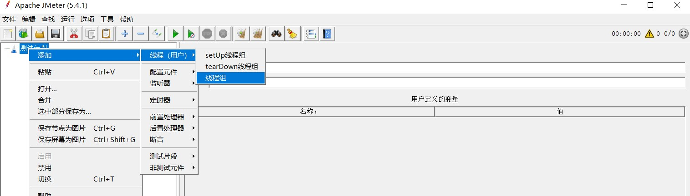
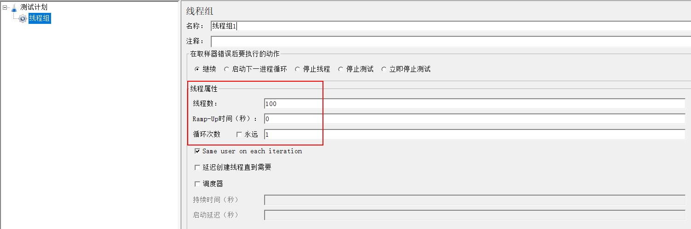
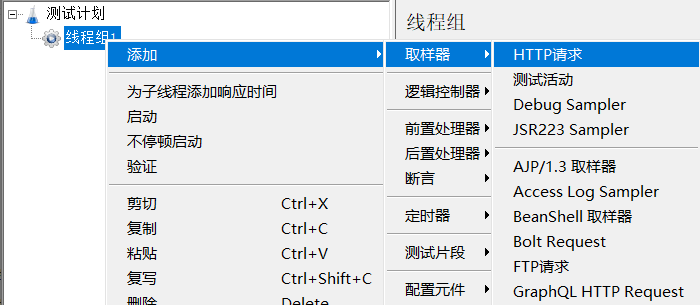
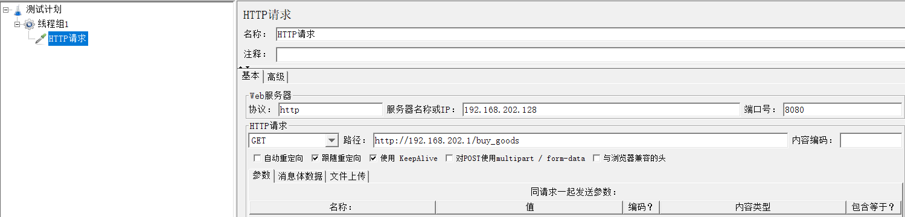

# Jmeter使用

Windows启动jmerter.bat即可

创建线程组

<figure><figcaption>
创建线程组
</figcaption></figure>

线程组配置

<figure><figcaption>
线程组配置
</figcaption></figure>

添加取样器

<figure><figcaption>
 添加取样器
</figcaption></figure>

取样器配置

<figure><figcaption>
取样器配置
</figcaption></figure>
