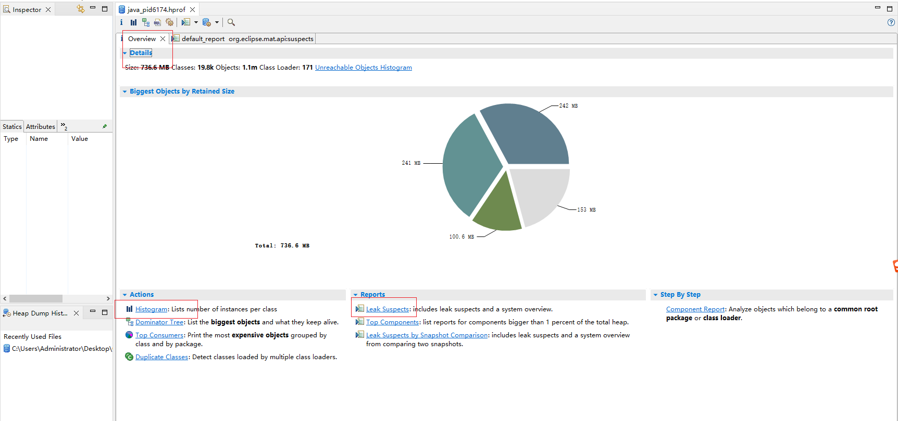
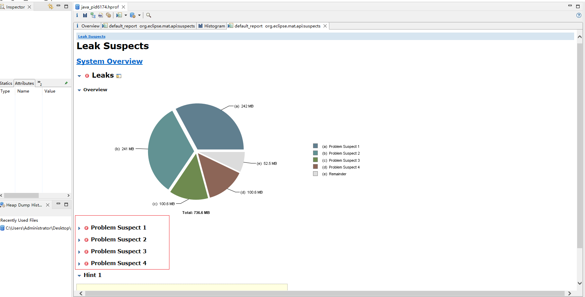
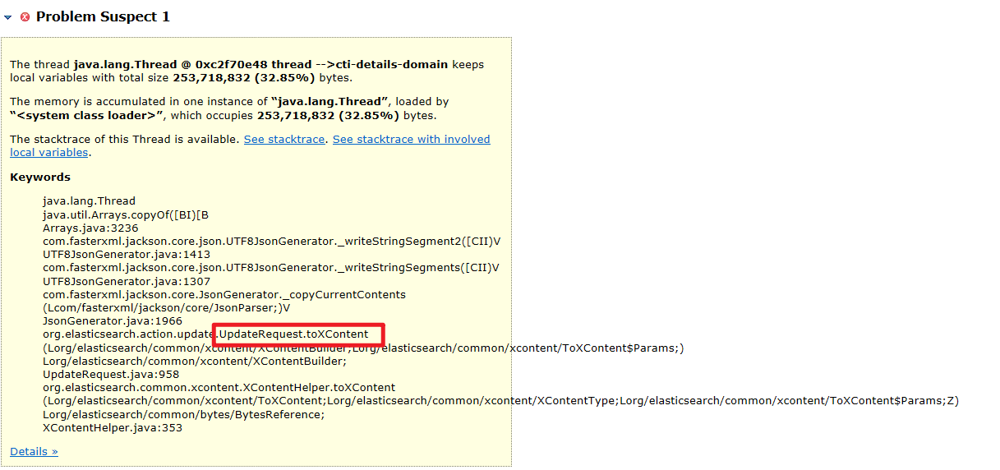
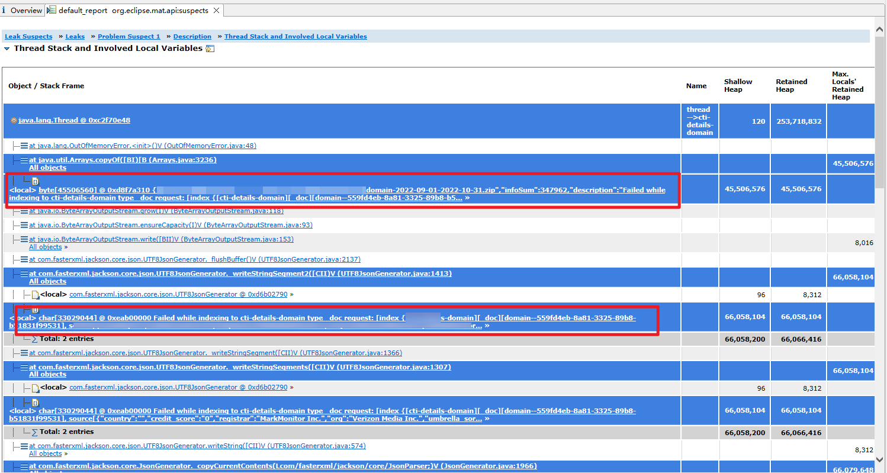

# 记录一次CPU100%与OOM

### 1. CPU100%

1.  定位耗费CPU的进程:`top -c` 键入P（大写） 可得到PID

    这里根据观测，拿到的结果是`PID: 21253`
2.  定位耗费CPU的线程：`top -Hp PID`

    `top -Hp 21253` 得到耗费CPU的线程ID==>`9401`
3.  将`线程ID: 9401` 转16进制：

    `printf "%x\n" 9401` ==> `24b9`
4. 定位详细代码块：`jstack 进程ID |grep "16进制的线程ID" -C5 --color`

`jstack 21253 | grep "0x24b9" -C5 --color`

可以看到是**1318**行与**1265**行出现的问题

<figure><figcaption></figcaption></figure>

<figure><figcaption></figcaption></figure>

1. 结合上下文及业务（这里的业务逻辑是这样的：我们每次会将需要操作的数据包放入到队列中，每次从队列中拿几个数据包出来进行操作，因为需要进行限制最大可操作的数据包数量，所以，在while(queue.size() > 0) 循环内，我们判断如果当前正在操作的数据包的数量是小于最大操作许可maxPermit时，我们可以从队列中获取，如果没有，那么就会进行自旋while(queue.size()>0)，直到数据包被消费掉，满足了当前正在操作的数据包数量小于最大操作许可maxPermit，才会继续从队列中获取），可以分析出CPU被打爆是因为在1318行代码自旋while循环，长时间`queue.size()> 0` 所以在这段时间内相当于执行while(true),那么CPU就会飙升100%。因为1265行每次都是new Thread()，所以多个请求进来都会new一个线程，导致了CPU飙升至几百上千。
2. **解决方案:** 根据业务情况，问题1：可以在`while`循环中加入休眠时间，解决CPU飙升100%，问题2：可以使用线程数为1的线程池来解决每次new一个线程导致CPU飙升至几百上千的问题。

### 2. OOM

1.  开启发生OOM之后dump出JVM堆内存快照的开关：`-XX:+HeapDumpOnOutOfMemoryError`

    如：`java -jar test.jar -XX:+HeapDumpOnOutOfMemeoryError` 发生OOM时，会产生一个xx.hprof文件

    这里是java\_pid6174.hprof
2.  使用Eclipse Memory Analyzer内存分析工具打开java\_pid6174.hprof文件，如图：

    <figure><figcaption></figcaption></figure>
3.  **点击上图中的leak Suspects**

    <figure><figcaption></figcaption></figure>
4.  这里分别对4个可疑点进行分析

    4.1 Problem Suspect1

    

    这里我们可以看到是和UpdateRequest有关，点击上图中的**See stacktrace with involved local variables** 可查看到相关的本地变量，如下图：

    其实看到这里，我已经可以猜到是哪一部分代码导致的OOM了，因为图中圈出来的部分是记录的报错日志，因为业务需要记录报错日志写入到ES中，由于业务需要，一个数据包中目前有的包含几千万条数据，小一点的也有几百万到千万条，**这里出现OOM的原因是 一条脏数据的记录日志\*巨大数据量 这样就会出现一个很大的值**，根据实际观测，当时发生OOM时错误日志描述信息的长度达到接近4kw。关于计算每个字符串的长度计算：(40+2\*n)，这样估算下来大概在50M左右。

    <figure><figcaption></figcaption></figure>

jmap -heap PID 可以查看当前进程使用的垃圾回收器与堆的使用大小。
