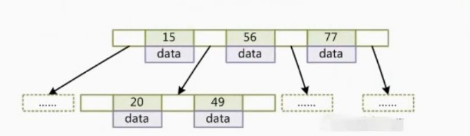

# MySQL索引（一）

　　索引时为了提高查询效率，比如书的目录一样，常见的数据结构，哈希表、有序数组和搜索树。

简单说一下索引的原理，这里不谈B-树，B+树的定义，我反正也记不住，直接聊一下相关的使用原理。

b-树大概就涨这样，

```
B-树的节点，满足左子树比右子树小，且中间的非叶子节点也存储数据Data

```

<figure><figcaption><p>b-树</p></figcaption></figure>

```
B+树的节点与B-树，差不多，只是Data数据只存在于叶子节点。多了一些相关的优化，
如在叶子节点增加指针，优化范围查询
```

<div align="center">

<figure><figcaption><p>b+树</p></figcaption></figure>

</div>


## 1.聚簇索引

　　在InnoDB里，索引类型分为主键索引与非主键索引。主键索引的叶子节点存储的是一整行数据，主键索引也被成为聚簇索引，非主键索引的叶子节点存储的是主键的值，非主键索引也被称为二级索引。

　　这里创建一个主键为ID，字段K，并且在K上面有索引。建表语句：

```
mysql>  create table T(
id int primary key,
k int not null,
name varchar(16),
index(k))engine=innodb;
```

.png>)

　　　图中表示的是表T的索引组织结构，表中 R1\~R5 的 (ID,k) 值分别为 (100,1)、(200,2)、(300,3)、(500,5) 和 (600,6)。

**提问**　　基于主键索引与非主键索引查询有什么区别？

主键索引的挂载的数据直接就是数据内容，非主键索引挂载的是主键ID，需要再走一遍主键索引树。

```
# 主键索引查询
select * from T where ID = 500

# 非主键索引查询
select * from T where K = 3
```

　　主键索引，通过ID，搜索B+树，即可直接找到对应的行数据，而非主键索引先通过InnoDB的索引组织结构找到K=3的ID=300，再通过ID=300去搜索B+树，找到对应的行数据，先找主键，通过主键再查找信息的整个过程称做**回表**

## 2.覆盖索引

```
select * from T where k between 3 and 5
```

　　我们先看一下上面这一条SQL会执行几次树搜索，扫描多少行（索引结构数据图参考上面）。

　　首先在K索引树上找到K=3的记录，对应的ID=300，通过ID=300回表找到R3，在K索引树取下一个K=5，查找ID=500，通过回表查找R5,取K索引树下一个K=6，不满足，结束。

　　可以发现上面我们经历了2次回表，读取了K索引树3次，因为查询的数据，只有在主键索引树上有，不得不经历回表。

**优化：使用覆盖索引**

```
select ID from T where k between 3 and 5
```

　　\*\*覆盖索引：**在索引树K上覆盖了了我们需要查询的ID值，我们称为**覆盖索引，\*\*我们就不需要回表操作，大幅度提升了查询性能，减少树的搜索次数。

## 3.最左前缀原则

　　联合索引（a,b），我们就不需要再创建索引（a）了，最左前缀可以是联合索引的最左M个字符或者N个字段，只要满足最左前缀原则就可以使用索引加速，因此，在建立联合索引时需要合理的考虑索引内字段的顺序，合理的安排可以少维护部分索引。

　　MySQL会一直向右匹配，直到遇到范围查询（>，<，between，like）就会停止匹配，比如a=3 and b=4 and c > 5 and d= 6，如果建立 的是(a,b,c,d)索引，d是用不到索引的，如果建立的是（a,b,d,c）则都可以用到。

## 4.索引下推

　　可以在索引遍历过程中，对索引中包含的字段先做判断，直接过滤掉不满足条件的记录，减少回表次数。

<figure><figcaption><p>索引下推</p></figcaption></figure>

## 5.提问

索引建立的越多越好吗？

答：并不是，\*\*a.\*\*创建索引需要更多的空间，\*\*b.\*\*数据量小的表并不需要建立索引，\*\*c.\*\*增加额外的开销，数据的变更需要维护索引。
